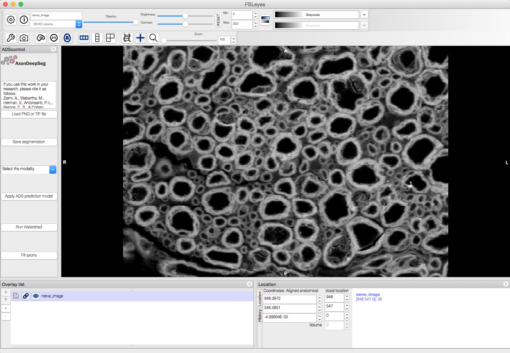
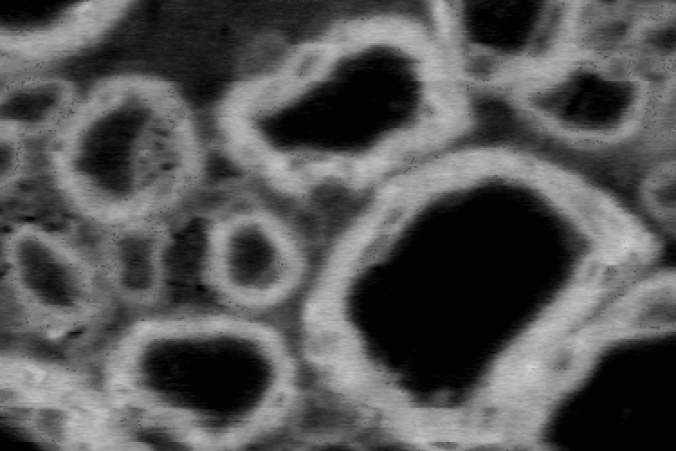
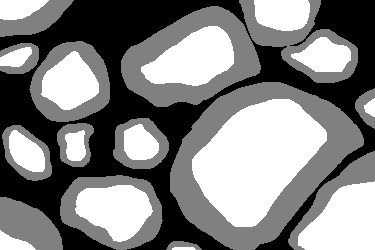

Introduction
============
AxonDeepSeg is an open-source software using deep learning and aiming at automatically segmenting axons and myelin sheaths from microscopy images. It performs 3-class semantic segmentation using a convolutional neural network.

AxonDeepSeg was developed at NeuroPoly Lab, Polytechnique Montreal, University of Montreal, Canada.

Installation
============
The following sections will help you install all the tools you need to run AxonDeepSeg.

.. NOTE :: Starting with Version 2.0, AxonDeepSeg supports the Windows operating system. However, please note that our continuous integration testing framework (TravisCI) only tests AxonDeepSeg for Unix-style systems, so releases may be more unstable for Windows than Linux/macOS.

Miniconda
---------
Starting with version 3.2.0, AxonDeepSeg is only supported using Python 3.7.x. Although your system may already have a Python environment installed, we strongly recommend that AxonDeepSeg be used with `Miniconda <https://conda.io/docs/glossary.html#miniconda-glossary>`_, which is a lightweight version of the `Anaconda distribution <https://www.anaconda.com/distribution/>`_. Miniconda is typically used to create virtual Python environments, which provides a separation of installation dependencies between different Python projects. Although it can be possible to install AxonDeepSeg without Miniconda or virtual environments, we will only provide instructions for this recommended installation setup.

First, verify if you already have an AxonDeepSeg-compatible version of Miniconda or Anaconda properly installed and is in your systems path. 

In a new terminal window (macOS or Linux) or Anaconda Prompt (Windows – if it is installed), run the following command:::

    conda search python

If a list of available Python versions are displayed and versions >=3.7.0 are available, you may skip to the next section (git).

Linux
~~~~~

To install Miniconda, run the following commands in your terminal:::

    cd ~
    wget https://repo.anaconda.com/miniconda/Miniconda3-latest-Linux-x86_64.sh -O ~/miniconda.sh
    bash ~/miniconda.sh -b -p $HOME/miniconda
    echo ". ~/miniconda/etc/profile.d/conda.sh" >> ~/.bashrc
    source ~/.bashrc

.. NOTE :: If ``conda`` isn't available on new terminal sessions after running these steps, it's possible that your system is configured to use a different startup script. Try adding the line ``source ~/.bashrc`` to your ``~/.bash_profile`` file. `See here <http://www.joshstaiger.org/archives/2005/07/bash_profile_vs.html>`_ for more details.

macOS
~~~~~

To install Miniconda, run the following commands in your terminal:::

    cd ~
    curl https://repo.anaconda.com/miniconda/Miniconda3-latest-MacOSX-x86_64.sh -o ~/miniconda.sh
    bash ~/miniconda.sh -b -p $HOME/miniconda
    echo ". ~/miniconda/etc/profile.d/conda.sh" >> ~/.bash_profile
    source ~/.bash_profile

Windows
~~~~~~~

.. NOTE :: The AxonDeepSeg installation instruction using the Miniconda have only been tested for Windows 10. Older versions of Windows may not be compatible with the tools required to run AxonDeepSeg.

To install Miniconda, go to the `Miniconda installation website <https://conda.io/miniconda.html>`_ and click on the Python 3.x version installer compatible with your Windows system (64 bit recommended). After the download is complete, execute the downloaded file, and follow the instructions. If you are unsure about any of the installation options, we recommend you use the default settings.

git
---
``git`` is a software version control system. Because AxonDeepSeg is hosted on GitHub, a service that hosts ``git`` repositories, having ``git`` installed on your system allows you to download the most up-to-date development version of AxonDeepSeg from a terminal, and also allows you to contribute to the project if you wish to do so.

To install ``git``, please follow instructions for your operating system on the `git website <https://git-scm.com/downloads>`_

Install AxonDeepSeg
-------------------

To install AxonDeepSeg, "clone" AxonDeepSeg's repository (you will need to have ``git`` installed on your system) and then open the directory::

    git clone https://github.com/neuropoly/axondeepseg.git
    cd axondeepseg

Virtual environments are a tool to separate the Python environment and packages used between Python projects. They allow for different versions of Python packages to be installed and managed for the specific needs of your projects. There are several virtual environment managers available, but the one we recommend and will use in our installation guide is `conda <https://conda.io/docs/>`_, which is installed by default with Miniconda. We strongly recommend you create a virtual environment before you continue with your installation.

To setup a Python virtual environment named "ads_venv" with all the required packages, in a terminal window (macOS or Linux) or Anaconda Prompt (Windows) run the following command and answer "y" to the installation instructions::

    conda env create -f environment.yml -n ads_venv

.. WARNING :: For some users, the installation may take up to 30 minutes as many dependencies have shared subdependencies, and resolving these potential conflicts takes time. If that's the case, we encourage you to take a break from your screen and go for a walk while listening to the `AxonDeepSeg Spotify playlist <https://open.spotify.com/playlist/27LVNnfhTKjVOli6bPCaV5?si=OydcwxoOSamwCsg3xcqybw>`_.

.. NOTE :: FSLeyes is only supported on Mac and Linux. Windows users are encouraged to use a virtual machine if they want to use the GUI. 

Then, activate your virtual environment::

    conda activate ads_venv

.. NOTE :: To switch back to your default environment, run:
  ::

       conda deactivate

Once your virtual environment is installed and activated, install the AxonDeepSeg software with the following commands::

    pip install -e .

.. NOTE :: To update an already cloned AxonDeepSeg package, pull the latest version of the project from GitHub and re-install the application:
   ::

        cd axondeepseg
        git pull
        pip install -e .

.. WARNING :: When re-installing the application, the ``default_SEM_model``, ``default_TEM_model`` and ``model_seg_pns_bf`` folders in ``AxonDeepSeg/models`` will be deleted and re-downloaded. Please do not store valuable data in these folders.

Testing the installation
------------------------
.. WARNING :: Ensure that the virtual environment is activated.

Quick test
~~~~~~~~~~

To test if the software was installed correctly, you can launch a quick integrity test by running the following command on the terminal::

    axondeepseg_test

This integrity test automatically performs the axon and myelin segmentation of a test sample. If the test succeeds, the following message will appear in the terminal::

    * * * Integrity test passed. AxonDeepSeg is correctly installed. * * * 

.. NOTE :: For some users, the test may fail because Keras is using Theano backend instead of Tensorflow. In that case, you will see the line ``Using Theano backend.`` when launching ``axondeepseg_test``. To fix this issue, add the line ``export KERAS_BACKEND="tensorflow"`` at the end of the ``<your_conda_install_location>\envs\<your_environment_name>/etc/conda/activate.d/keras_activate.sh`` file, then deactivate and reactivate your environment. The test should print ``Using Tensorflow backend.`` and pass.

Comprehensive test
~~~~~~~~~~~~~~~~~~

To run the entire testing suite (more code coverage), go to your AxonDeepSeg project directory on the terminal and run ``py.test``::

    cd axondeepseg
    py.test --cov AxonDeepSeg/ --cov-report term-missing

If all tests pass, AxonDeepSeg was installed succesfully.

Graphical User Interface (GUI) (optional)
-----------------------------------------

AxonDeepSeg can be run via a Graphical User Interface (GUI) instead of the Terminal command line. This GUI is a plugin for the software `FSLeyes <https://fsl.fmrib.ox.ac.uk/fsl/fslwiki/FSLeyes>`_. Beyond the convenience of running AxonDeepSeg with the click of a button, this GUI is also an excellent way to manually correct output segmentations (if need to).

Launch FSLeyes ::

           fsleyes

In FSLeyes, do the following:
- Click on ``file -> load plugin``
- Select ``ads_plugin.py`` (found in AxonDeepSeg folder)
- When asked ``Install permanently`` click on ``yes``.

From now on, you can access the plugin on the FSLeyes interface by selecting ``Settings -> Ortho View -> ADScontrol``.

In case, you find trouble installing FSLeyes plugin for ADS you could refer the video below.

.. raw:: html

   

     <iframe width="700" height="394" src="https://www.youtube.com/embed/qzWeG5vaVyo" frameborder="0" allowfullscreen></iframe>

.. NOTE :: For some users, the ADScontrol tab will not appear after first installing the plugin.
           To resolve this issue, please close FSLeyes and relaunch it (within your virtual environment).
           This step may only be required when you first install the plugin.

Known issues
~~~~~~~~~~~~
1. The FSLeyes installation doesn't always work on Linux. Refer to the `FSLeyes installation guide <https://users.fmrib.ox.ac.uk/~paulmc/fsleyes/userdoc/latest/install.html>`_ if you need. In our testing, most issues came from the installation of the wxPython package.

GPU-compatible installation
---------------------------
.. NOTE :: This feature is not available if you are using a macOS.

Linux and Windows 10
~~~~~~~

By default, AxonDeepSeg installs the CPU version of TensorFlow. To train a model using your GPU, you need to uninstall the TensorFlow from your virtual environment, and install the GPU version of it::

    conda uninstall tensorflow
    conda install -c anaconda tensorflow-gpu==1.13.1

This might uninstall keras in the process, so we need to install it again ::

    conda install -c conda-forge keras==2.2.4
    

Existing models
===============

Three models are available and shipped together with the installation package, so you don't need to install them separately.
The three models are described below:

* A SEM model, that works at a resolution of 0.1 micrometer per pixel.
* A TEM model, that works at a resolution of 0.01 micrometer per pixel.
* A OM model, that works at a resolution of 0.1 micrometer per pixel.

Using AxonDeepSeg
=================

Activate the virtual environment
--------------------------------

To use AxonDeepSeg, you must first activate the virtual environment if it isn't currently activated. To do so, run::

    conda activate ads_venv

.. NOTE :: To switch back to your default environment, run:
  ::

       conda deactivate

Example dataset
---------------

You can demo the AxonDeepSeg by downloading the test data available `here <https://osf.io/rtbwc/download>`_. It contains two SEM test samples and one TEM test sample.

Segmentation
------------

Syntax
~~~~~~

The script to launch is called **axondeepseg**. It takes several arguments:

**Required arguments:**

-t MODALITY            
                    Type of acquisition to segment.
                    SEM: scanning electron microscopy samples. 
                    TEM: transmission electron microscopy samples.
                    OM: bright field optical microscopy samples.

-i IMGPATH
                    Path to the image to segment or path to the folder where the image(s) to segment is/are located.

**Optional arguments:**

-m MODEL            Folder where the model is located. 
                    The default SEM model path is **default_SEM_model**. 
                    The default TEM model path is **default_TEM_model**.
                    The default OM model path is **model_seg_pns_bf**.

-s SIZEPIXEL        Pixel size of the image(s) to segment, in micrometers. 
                    If no pixel size is specified, a **pixel_size_in_micrometer.txt** file needs to be added to the image folder path ( that file should contain a single float number corresponding to the resolution of the image, i.e. the pixel size). The pixel size in that file will be used for the segmentation.

-v VERBOSITY        Verbosity level. 
                    **0** (default) : Displays the progress bar for the segmentation. 
                    **1**: Also displays the path of the image(s) being segmented. 
                    **2**: Also displays the information about the prediction step for the segmentation of current sample. 
                    **3**: Also displays the patch number being processed in the current sample.

--overlap           Overlap value (in pixels) of the patches when doing the segmentation. 
                    Higher values of overlap can improve the segmentation at patch borders, but also increase the segmentation time. Default value: 25. Recommended range of values: [10-100]. 

.. NOTE :: You can get the detailed description of all the arguments of the **axondeepseg** command at any time by using the **-h** argument:
   ::

        axondeepseg -h

Segment a single image
^^^^^^^^^^^^^^^^^^^^^^

To segment a single microscopy image, specify the path to the image to segment in the **-i** argument. For instance, to segment the SEM image **'77.png'** of the test dataset that has a pixel size of 0.07 micrometers, use the following command::

    axondeepseg -t SEM -i test_segmentation/test_sem_image/image1_sem/77.png -s 0.07

The script will use the explicitely specified size argument (here, 0.07) for the segmentation. If no pixel size is provided in the arguments, it will automatically read the image resolution encoded in the file **'pixel_size_in_micrometer.txt'** if that file exists in the folder containing the image to segment.
The segmented acquisition will be saved in the same folder as the acquisition image, with the suffix **'_seg-axonmyelin.png'**, in *png* format, along with the binary axon and myelin segmentation masks (with the suffixes **'_seg-axon.png'** and **'_seg-myelin.png'**). In our example, the following output files will be generated: **'77_seg-axonmyelin.png'**, **'77_seg-axon.png'** and **'77_seg-myelin.png'**.

To segment the same image by using the **'pixel_size_in_micrometer.txt'** file in the folder (i.e. not specifying the pixel size as argument in the command), use the following command::

    axondeepseg -t SEM -i test_segmentation/test_sem_image/image1_sem/77.png

Segment multiple images of the same resolution
^^^^^^^^^^^^^^^^^^^^^^^^^^^^^^^^^^^^^^^^^^^^^^

To segment multiple microscopy images of the same resolution that are located in the same folder, specify the path to the folder in the **-i** argument. For instance, to segment the images in folder **'test_sem_image/image1_sem/'** of the test dataset that have a pixel size of 0.07 micrometers, use the following command::

    axondeepseg -t SEM -i test_segmentation/test_sem_image/image1_sem/ -s 0.07

To segment multiple images of the same folder and of the same resolution by using the **'pixel_size_in_micrometer.txt'** file in the folder (i.e. not specifying the pixel size as argument in the command), use the following folder structure::

    --folder_with_samples/
    ---- image_1.png
    ---- image_2.png
    ---- image_3.png
    ---- ...
    ---- pixel_size_in_micrometer.txt
    ...

Then, use the following command::

    axondeepseg -t SEM -i test_segmentation/test_sem_image/image1_sem/

Segment images from multiple folders
^^^^^^^^^^^^^^^^^^^^^^^^^^^^^^^^^^^^

To segment images that are located in different folders, specify the path to the folders in the **-i** argument, one after the other. For instance, to segment all the images of folders **'test_sem_image/image1_sem/'** and **'test_sem_image/image2_sem/'** of the test dataset, use the following command::

    axondeepseg -t SEM -i test_segmentation/test_sem_image/image1_sem/ test_segmentation/test_sem_image/image2_sem/

Morphometrics
-------------

You can generate morphometrics using AxonDeepSeg via the command line interface.

Syntax
~~~~~~

The script to launch in called **axondeepseg_morphometrics**. It has several arguments.

**Required arguments:**

-i IMGPATH
                    Path to the image file whose morphometrics needs to be calculated.

**Optional arguments:**

-s SIZEPIXEL        Pixel size of the image(s) to segment, in micrometers. 
                    If no pixel size is specified, a **pixel_size_in_micrometer.txt** file needs to be added to the image folder path (that file should contain a single float number corresponding to the resolution of the image, i.e. the pixel size). The pixel size in that file will be used for the morphometrics computation.

-f FILENAME         Name of the excel file in which the morphometrics will be stored.
                    The excel file extension can either be **.xlsx** or **.csv**.
                    If name of the excel file is not provided, the morphometrics will be saved as **axon_morphometrics.xlsx**.

Morphometrics of a single image
^^^^^^^^^^^^^^^^^^^^^^^^^^^^^^^
Before computing the morphometrics of an image, make sure it has been segmented using AxonDeepSeg ::

    axondeepseg_morphometrics -i test_segmentation/test_sem_image/image1_sem/77.png -f axon_morphometrics 

This generates a **'axon_morphometrics.xlsx'** file in the image directory::

    --image1_sem/
    ---- 77.png
    ---- 77_seg-axon.png
    ---- 77_seg-axonmyelin.png
    ---- 77_seg-myelin.png
    ---- pixel_size_in_micrometer.txt
    ---- axon_morphometrics.xlsx
    ...

Morphometrics of images from multiple folders
^^^^^^^^^^^^^^^^^^^^^^^^^^^^^^^^^^^^^^^^^^^^^
To generate morphometrics of images which are located in different folders, specify the path of the image folders using the **-i** argumument of the CLI separated by space. For instance, to compute morphometrics of the images present in the folders **'test_sem_image/image1_sem/'** and **'test_sem_image/image2_sem/'** of the test dataset, use the following command::

    axondeepseg_morphometrics -i test_segmentation/test_sem_image/image1_sem/77.png test_segmentation/test_sem_image/image2_sem/image.png

This will generate **'axon_morphometrics.xlsx'** file in each of folders:: 

    --image1_sem/
    ---- 77.png
    ---- 77_seg-axon.png
    ---- 77_seg-axonmyelin.png
    ---- 77_seg-myelin.png
    ---- pixel_size_in_micrometer.txt
    ---- axon_morphometrics.xlsx
    ...

    --image2_sem/
    ---- image.png
    ---- image_seg-axon.png
    ---- image_seg-axonmyelin.png
    ---- image_seg-myelin.png
    ---- pixel_size_in_micrometer.txt
    ---- axon_morphometrics.xlsx

Jupyter notebooks
-----------------

Here is a list of useful Jupyter notebooks available with AxonDeepSeg:

* `getting_started.ipynb <https://github.com/neuropoly/axondeepseg/blob/master/notebooks/00-getting_started.ipynb>`_:
    Notebook that shows how to perform axon and myelin segmentation of a given sample using a Jupyter notebook (i.e. not using the command line tool of AxonDeepSeg). You can also launch this specific notebook without installing and/or cloning the repository by using the `Binder link <https://mybinder.org/v2/gh/neuropoly/axondeepseg/master?filepath=notebooks%2F00-getting_started.ipynb>`_.

* `guide_dataset_building.ipynb <https://github.com/neuropoly/axondeepseg/blob/master/notebooks/01-guide_dataset_building.ipynb>`_:
    Notebook that shows how to prepare a dataset for training. It automatically divides the dataset samples and corresponding label masks in patches of same size.

* `training_guideline.ipynb <https://github.com/neuropoly/axondeepseg/blob/master/notebooks/02-training_guideline.ipynb>`_:
    Notebook that shows how to train a new model on AxonDeepSeg. It also defines the main parameters that are needed in order to build the neural network.

* `performance_metrics.ipynb <https://github.com/neuropoly/axondeepseg/blob/master/notebooks/03-performance_metrics.ipynb>`_:
    Notebook that computes a large set of segmentation metrics to assess the axon and myelin segmentation quality of a given sample (compared against a ground truth mask). Metrics include sensitivity, specificity, precision, accuracy, Dice, Jaccard, F1 score, Hausdorff distance.

* `morphometrics_extraction.ipynb <https://github.com/neuropoly/axondeepseg/blob/master/notebooks/04-morphometrics_extraction.ipynb>`_:
    Notebook that shows how to extract morphometrics from a sample segmented with AxonDeepSeg. The user can extract and save morphometrics for each axon (diameter, solidity, ellipticity, centroid, ...), estimate aggregate morphometrics of the sample from the axon/myelin segmentation (g-ratio, AVF, MVF, myelin thickness, axon density, ...), and generate overlays of axon/myelin segmentation masks, colocoded for axon diameter.

.. NOTE ::
    If it is the first time, install the Jupyter notebook package in the terminal::

        pip install jupyter

    Then, go to the notebooks/ subfolder of AxonDeepSeg and launch a particular notebook as follows::

        cd notebooks
        jupyter notebook name_of_the_notebook.ipynb 

.. WARNING ::
   The current models available for segmentation are trained for patches of 512x512 pixels. This means that your input image(s) should be at least 512x512 pixels in size **after the resampling to the target pixel size of the model you are using to segment**. 

   For instance, the TEM model currently available has a target resolution of 0.01 micrometers per pixel, which means that the minimum size of the input image (in micrometers) is 5.12x5.12.

   **Option:** If your image to segment is too small, you can use padding to artificially increase its size (i.e. add empty pixels around the borders).

Guide for manual labelling
==========================

Manual masks for training your own model
----------------------------------------

To be able to train your own model, you will need to manually segment a set of masks. The deep learning model quality will only be as good as your manual masks, so it's important to take care at this step and define your cases.

Technical properties of the manual masks:

* They should be 8-bit PNG files with 1 channel (256 grayscale).
* They should be the same height and width as the images.
* They should contain only 3 unique color values : 0 (black) for background, 127 (gray) for myelin and 255 (white) for axons, and no other intermediate values on strutures edges.
* If you are unfamiliar with those properties, don't worry, the detailed procedures provided in the section below will allow you to follow these guidelines.

Qualitative properties of the manual masks:

* Make sure that every structure (background, myelin or axons) contains only the color of that specific structure (e.g., no black pixels (background) in the axons or the myelin, no white pixels (axons) in the background or myelin, etc.)
* For normal samples without myelin splitting away from the axons, make sure that there is no black pixels (background) on the edges between myelin and axons.

To create a manual mask for training, you can try one of the following:

* Try segmenting your images with AxonDeepSeg's default models and make manual corrections of the segmentation masks in FSLeyes or GIMP software.
* Create a new manual mask using GIMP software.

These options and detailed procedures are described in the section below "Manual correction of segmentation masks".

Here are examples of an image, a good manual mask and a bad manual mask.

    Image example

    Good manual mask example

.. figure:: _static/bad_mask_example.png
    :width: 750px
    :align: center
    :alt: Bad manual mask example
    
    Bad manual mask example

Manual correction of segmentation masks
---------------------------------------

If the segmentation with AxonDeepSeg does not give optimal results, you can try one of the following options:

**Option 1: manual correction of the segmentation mask with FSLeyes**

* In FSLeyes, you can make corrections on the myelin segmentation mask using the Edit mode in **Tools > Edit mode**.
* Then, use the **Fill Axons** function to automatically fill the axons and create a corrected axon+myelin mask.
* For a detailed procedure, please consult the following link: `Manual correction with FSLeyes <https://docs.google.com/document/d/1S8i96cJyWZogsMw4RrlQYwglcOWd3HrM5bpTOJE4RBQ/edit>`_.
* As a reference, you can find more informtations about the FSLeyes Edit mode in the `user guide <https://users.fmrib.ox.ac.uk/~paulmc/fsleyes/userdoc/latest/editing_images.html>`_.

**Option 2: manual labelling with GIMP software**

* To create a new axon+myelin manual mask or to make manual correction on an existing segmentation mask, you can use the GIMP software (`Link for download <https://www.gimp.org/>`_).
* If you are making correction on an existing segmentation mask, note that when you launch a segmentation, in the folder output, you will also find the axon and myelin masks (with the suffixes **'_seg-axon.png'** and **'_seg-myelin.png'**). You can then manually correct the myelin mask and create a corrected axon+myelin mask.
* For a detailed procedure, please consult the following link: `Manual labelling with GIMP <https://docs.google.com/document/d/10E6gzMP6BNGJ_7Y5PkDFmum34U-IcbMi8AvRruhIzvM/edit>`_.

Help
====

Whether you are a newcomer or an experienced user, we will do our best to help and reply to you as soon as possible. Of course, please be considerate and respectful of all people participating in our community interactions.

* If you encounter difficulties during installation and/or while using AxonDeepSeg, or have general questions about the project, you can start a new discussion on `AxonDeepSeg GitHub Discussions forum <https://github.com/neuropoly/axondeepseg/discussions>`_. We also encourage you, once you've familiarized yourself with the software, to continue participating in the forum by helping answer future questions from fellow users!
* If you encounter bugs during installation and/or use of AxonDeepSeg, you can open a new issue ticket on the `AxonDeepSeg GitHub issues tracker <https://github.com/neuropoly/axondeepseg/issues>`_.

Citation
========

If you use this work in your research, please cite:

Zaimi, A., Wabartha, M., Herman, V., Antonsanti, P.-L., Perone, C. S., & Cohen-Adad, J. (2018). AxonDeepSeg: automatic axon and myelin segmentation from microscopy data using convolutional neural networks. Scientific Reports, 8(1), 3816. `Link to the paper <https://doi.org/10.1038/s41598-018-22181-4>`_.
